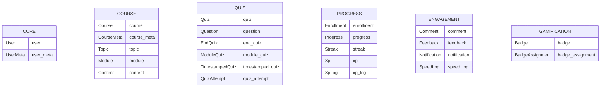
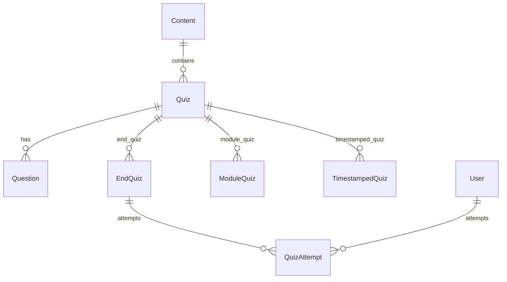

# Laravel Application Models

This document describes all 24 Eloquent models in the application, grouped by domain.

## Table of Contents

- [Domain Overview](#domain-overview)
- [Core Models](#core-models)
- [Course Models](#course-models)
- [Quiz Models](#quiz-models)
- [Progress Models](#progress-models)
- [Engagement Models](#engagement-models)
- [Gamification Models](#gamification-models)

---

## Domain Overview

---

## Core Models

### User

| Property | Value |
|----------|-------|
| Table | `users` |
| Key | `id` (auto-increment) |
| Purpose | Authentication and authorization entity |

**Relationships:**

| Method | Type | Related Model | Description |
|--------|------|---------------|-------------|
| `meta()` | HasOne | `UserMeta` | Single user metadata record |
| `enrollments()` | HasMany | `Enrollment` | User's course enrollments |
| `enrolledCourses()` | BelongsToMany | `Course` | Courses user is enrolled in |
| `progress()` | HasMany | `Progress` | User's content progress |
| `feedback()` | HasMany | `Feedback` | User's course feedback |
| `comments()` | HasMany | `Comment` | User's comments on content |
| `quizAttempts()` | HasMany | `QuizAttempt` | User's quiz attempts |
| `speedLogs()` | HasMany | `SpeedLog` | User's video speed changes |
| `streaks()` | HasMany | `Streak` | User's daily streaks |
| `xp()` | HasOne | `Xp` | User's total XP |
| `xpLogs()` | HasMany | `XpLog` | User's XP change history |
| `badges()` | BelongsToMany | `Badge` | Badges earned by user |
| `notifications()` | HasMany | `Notification` | User's notifications |

---

### UserMeta

| Property | Value |
|----------|-------|
| Table | `user_meta` |
| Key | `id` (auto-increment) |
| Purpose | Extended user profile information |

**Attributes:**
- `phone_number` - User's phone number
- `address` - User's address

**Relationships:**

| Method | Type | Related Model | Description |
|--------|------|---------------|-------------|
| `user()` | BelongsTo | `User` | Owner of metadata |

---

## Course Models

### Course

| Property | Value |
|----------|-------|
| Table | `courses` |
| Key | `id` (auto-increment) |
| Purpose | Main course entity containing topics and modules |

**Relationships:**

| Method | Type | Related Model | Description |
|--------|------|---------------|-------------|
| `contents()` | HasManyThrough | `Content` | All content through modules |
| `topics()` | HasMany | `Topic` | Course topics |
| `courseMeta()` | HasOne | `CourseMeta` | Course metadata |
| `enrollments()` | HasMany | `Enrollment` | Course enrollments |
| `enrolledUsers()` | BelongsToMany | `User` | Users enrolled in course |
| `feedback()` | HasMany | `Feedback` | Course feedback |

---

### CourseMeta

| Property | Value |
|----------|-------|
| Table | `course_meta` |
| Key | `id` (auto-increment) |
| Purpose | Extended course information |

**Attributes:**
- `category` - Course category
- `thumbnail` - Course thumbnail URL
- `difficulty` - Course difficulty level
- `duration` - Course duration
- `data` - JSON metadata

**Relationships:**

| Method | Type | Related Model | Description |
|--------|------|---------------|-------------|
| `course()` | BelongsTo | `Course` | Parent course |

---

### Topic

| Property | Value |
|----------|-------|
| Table | `topics` |
| Key | `id` (auto-increment) |
| Purpose | Grouping entity for modules within a course |

**Attributes:**
- `name` - Topic name
- `description` - Topic description
- `order` - Display order

**Relationships:**

| Method | Type | Related Model | Description |
|--------|------|---------------|-------------|
| `course()` | BelongsTo | `Course` | Parent course |
| `modules()` | HasMany | `Module` | Topic modules |

---

### Module

| Property | Value |
|----------|-------|
| Table | `modules` |
| Key | `id` (auto-increment) |
| Purpose | Container for content items |

**Attributes:**
- `title` - Module title
- `description` - Module description
- `order` - Display order

**Relationships:**

| Method | Type | Related Model | Description |
|--------|------|---------------|-------------|
| `topic()` | BelongsTo | `Topic` | Parent topic |
| `contents()` | HasMany | `Content` | Module content items |

---

### Content

| Property | Value |
|----------|-------|
| Table | `contents` |
| Key | `id` (auto-increment) |
| Purpose | Individual learning content (video, text, etc.) |

**Attributes:**
- `title` - Content title
- `body` - Content body/text
- `type` - Content type (enum: ContentType)
- `content_url` - URL for media content
- `content_meta` - JSON metadata

**Relationships:**

| Method | Type | Related Model | Description |
|--------|------|---------------|-------------|
| `module()` | BelongsTo | `Module` | Parent module |
| `course()` | HasOneThrough | `Course` | Parent course |
| `comments()` | HasMany | `Comment` | Content comments |
| `endQuiz()` | HasMany | `EndQuiz` | End-of-content quizzes |
| `quizzes()` | HasMany | `Quiz` | Content quizzes |
| `timestampedQuizzes()` | HasMany | `TimestampedQuiz` | Timestamped quizzes |
| `progress()` | HasMany | `Progress` | User progress records |
| `speedLogs()` | HasMany | `SpeedLog` | Video speed logs |

---

## Quiz Models

### Quiz Architecture Overview

---

### Quiz

| Property | Value |
|----------|-------|
| Table | `quizzes` |
| Key | `id` (auto-increment) |
| Purpose | Collection of questions attached to content |

**Relationships:**

| Method | Type | Related Model | Description |
|--------|------|---------------|-------------|
| `content()` | BelongsTo | `Content` | Parent content |
| `question()` | BelongsTo | `Question` | Associated question |
| `module()` | HasOneThrough | `Module` | Parent module |
| `endQuizzes()` | HasMany | `EndQuiz` | End quiz references |
| `moduleQuizzes()` | HasMany | `ModuleQuiz` | Module quiz references |
| `timestampedQuizzes()` | HasMany | `TimestampedQuiz` | Timestamped quiz references |

**Methods:**
- `isEndQuiz(): bool` - Check if quiz is an end quiz
- `isModuleQuiz(): bool` - Check if quiz is a module quiz
- `isTimestampedQuiz(): bool` - Check if quiz is a timestamped quiz

---

### Question

| Property | Value |
|----------|-------|
| Table | `questions` |
| Key | `id` (auto-increment) |
| Purpose | Individual quiz question |

**Attributes:**
- `type` - Question type
- `question_text` - Question content
- `options` - Answer options (JSON array)
- `correct_answer` - Correct answer(s) (JSON array)

**Relationships:**

| Method | Type | Related Model | Description |
|--------|------|---------------|-------------|
| `endQuiz()` | HasMany | `EndQuiz` | End quiz references |

---

### EndQuiz

| Property | Value |
|----------|-------|
| Table | `end_quiz` |
| Key | `id` (auto-increment) |
| Purpose | Quiz at the end of content completion |

**Relationships:**

| Method | Type | Related Model | Description |
|--------|------|---------------|-------------|
| `content()` | BelongsTo | `Content` | Parent content |
| `quiz()` | BelongsTo | `Quiz` | Associated quiz |
| `question()` | HasOneThrough | `Question` | Quiz question |
| `module()` | HasOneThrough | `Module` | Parent module |
| `attempts()` | HasMany | `QuizAttempt` | User attempts |

---

### ModuleQuiz

| Property | Value |
|----------|-------|
| Table | `module_quiz` |
| Key | `id` (auto-increment) |
| Purpose | Quiz at the module level |

**Relationships:**

| Method | Type | Related Model | Description |
|--------|------|---------------|-------------|
| `module()` | BelongsTo | `Module` | Parent module |
| `quiz()` | BelongsTo | `Quiz` | Associated quiz |
| `question()` | HasOneThrough | `Question` | Quiz question |
| `content()` | HasOneThrough | `Content` | First content in module |

---

### TimestampedQuiz

| Property | Value |
|----------|-------|
| Table | `timestamped_quiz` |
| Key | `id` (auto-increment) |
| Purpose | Quiz at specific video timestamp |

**Attributes:**
- `timestamp` - Video timestamp in seconds

**Relationships:**

| Method | Type | Related Model | Description |
|--------|------|---------------|-------------|
| `content()` | BelongsTo | `Content` | Parent content |
| `quiz()` | BelongsTo | `Quiz` | Associated quiz |
| `question()` | HasOneThrough | `Question` | Quiz question |
| `module()` | HasOneThrough | `Module` | Parent module |

---

### QuizAttempt

| Property | Value |
|----------|-------|
| Table | `quiz_attempts` |
| Key | `id` (auto-increment) |
| Purpose | User's attempt at a quiz |
| Timestamps | Disabled (uses `attempted_at` cast) |

**Attributes:**
- `score` - Attempt score

**Relationships:**

| Method | Type | Related Model | Description |
|--------|------|---------------|-------------|
| `user()` | BelongsTo | `User` | User who attempted |
| `quiz()` | BelongsTo | `Quiz` | Quiz attempted |

---

## Progress Models

### Enrollment

| Property | Value |
|----------|-------|
| Table | `enrollments` |
| Key | Composite: `[user_id, course_id]` |
| Purpose | User's enrollment in a course |
| Timestamps | Disabled (uses `enrolled_at` cast) |

**Attributes:**
- `enrolled_by` - User who enrolled (self or admin)
- `deadline` - Enrollment deadline

**Relationships:**

| Method | Type | Related Model | Description |
|--------|------|---------------|-------------|
| `user()` | BelongsTo | `User` | Enrolled user |
| `enrolledBy()` | BelongsTo | `User` | Who enrolled the user |
| `course()` | BelongsTo | `Course` | Enrolled course |

---

### Progress

| Property | Value |
|----------|-------|
| Table | `progress` |
| Key | Composite: `[user_id, content_id]` |
| Purpose | User's completion status for content |
| Timestamps | Disabled (uses `completed_at` cast) |

**Relationships:**

| Method | Type | Related Model | Description |
|--------|------|---------------|-------------|
| `user()` | BelongsTo | `User` | User with progress |
| `content()` | BelongsTo | `Content` | Content being tracked |

---

### Streak

| Property | Value |
|----------|-------|
| Table | `streaks` |
| Key | Composite: `[user_id, date]` |
| Purpose | User's daily activity streak |

**Attributes:**
- `count` - Streak count
- `date` - Streak date

**Relationships:**

| Method | Type | Related Model | Description |
|--------|------|---------------|-------------|
| `user()` | BelongsTo | `User` | User with streak |

---

### Xp

| Property | Value |
|----------|-------|
| Table | `xp` |
| Key | `user_id` |
| Purpose | User's total experience points |
| Timestamps | Disabled (uses `updated_at` cast) |

**Attributes:**
- `xp` - Total XP amount

**Relationships:**

| Method | Type | Related Model | Description |
|--------|------|---------------|-------------|
| `user()` | BelongsTo | `User` | User with XP |

---

### XpLog

| Property | Value |
|----------|-------|
| Table | `xp_logs` |
| Key | `id` (auto-increment) |
| Purpose | History of XP changes |
| Timestamps | Disabled (uses `created_at` cast) |

**Attributes:**
- `xp_change` - XP amount change (positive/negative)
- `reason` - Reason for XP change

**Relationships:**

| Method | Type | Related Model | Description |
|--------|------|---------------|-------------|
| `user()` | BelongsTo | `User` | User whose XP changed |

---

## Engagement Models

### Comment

| Property | Value |
|----------|-------|
| Table | `comments` |
| Key | `id` (auto-increment) |
| Purpose | User comments on content |

**Attributes:**
- `comment_text` - Comment content
- `parent_comment_id` - Parent comment for replies

**Relationships:**

| Method | Type | Related Model | Description |
|--------|------|---------------|-------------|
| `content()` | BelongsTo | `Content` | Commented content |
| `parent()` | BelongsTo | `Comment` | Parent comment |
| `replies()` | HasMany | `Comment` | Reply comments |
| `user()` | BelongsTo | `User` | Comment author |

---

### Feedback

| Property | Value |
|----------|-------|
| Table | `feedback` |
| Key | `id` (auto-increment) |
| Purpose | User feedback on courses |
| Timestamps | Disabled (uses `created_at` cast) |

**Attributes:**
- `rating` - Course rating
- `comments` - Feedback comments

**Relationships:**

| Method | Type | Related Model | Description |
|--------|------|---------------|-------------|
| `user()` | BelongsTo | `User` | Feedback author |
| `course()` | BelongsTo | `Course` | Course being rated |

---

### Notification

| Property | Value |
|----------|-------|
| Table | `notifications` |
| Key | `id` (auto-increment) |
| Purpose | User notifications |

**Attributes:**
- `subject` - Notification subject
- `description` - Notification description
- `status` - Notification status (enum: NotificationStatus)

**Relationships:**

| Method | Type | Related Model | Description |
|--------|------|---------------|-------------|
| `user()` | BelongsTo | `User` | Notification recipient |

---

### SpeedLog

| Property | Value |
|----------|-------|
| Table | `speed_logs` |
| Key | `id` (auto-increment) |
| Purpose | Video playback speed changes |
| Timestamps | Disabled (uses `logged_at` cast) |

**Attributes:**
- `event` - Video event type (enum: VideoEvent)
- `speed` - Playback speed

**Relationships:**

| Method | Type | Related Model | Description |
|--------|------|---------------|-------------|
| `user()` | BelongsTo | `User` | User who changed speed |
| `content()` | BelongsTo | `Content` | Video content |

---

## Gamification Models

### Badge

| Property | Value |
|----------|-------|
| Table | `badges` |
| Key | `id` (auto-increment) |
| Purpose | Achievements users can earn |

**Attributes:**
- `image` - Badge image URL
- `title` - Badge title
- `description` - Badge description
- `conditions` - JSON conditions to earn badge

**Relationships:**

| Method | Type | Related Model | Description |
|--------|------|---------------|-------------|
| `users()` | BelongsToMany | `User` | Users who earned badge |

---

### BadgeAssignment

| Property | Value |
|----------|-------|
| Table | `badge_assignments` |
| Key | Composite: `[user_id, badge_id]` |
| Purpose | Records when users earn badges |
| Timestamps | Disabled (uses `assigned_at` cast) |

**Relationships:**

| Method | Type | Related Model | Description |
|--------|------|---------------|-------------|
| `user()` | BelongsTo | `User` | User who earned badge |
| `badge()` | BelongsTo | `Badge` | Earned badge |

---

## Enums Used in Models

| Enum | Models Using |
|------|--------------|
| `Role` | `User` |
| `College` | `User` |
| `Department` | `User` |
| `ContentType` | `Content` |
| `NotificationStatus` | `Notification` |
| `VideoEvent` | `SpeedLog` |

---

## Key Architectural Patterns

1. **Polymorphic Quiz Usage**: The `Quiz` model serves as a central collection of questions, used polymorphically via `EndQuiz`, `ModuleQuiz`, and `TimestampedQuiz` to support different quiz placement scenarios.

2. **Composite Keys**: Several models use composite primary keys:
   - `Enrollment`: `[user_id, course_id]`
   - `Progress`: `[user_id, content_id]`
   - `Streak`: `[user_id, date]`
   - `BadgeAssignment`: `[user_id, badge_id]`
   - `Xp`: `user_id`

3. **HasManyThrough**: Used extensively for traversing relationships across multiple models (e.g., `Course -> Content`, `Content -> Course`).
