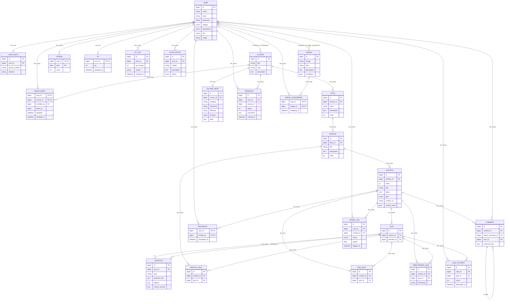

# Model ER Diagram

This document summarizes the relationships defined in `app/Models`.

## Core entities

- `User`: authentication, enrollment, activity, gamification
- `Course`: top-level learning container
- `Topic`: belongs to a course
- `Module`: belongs to a topic
- `Content`: belongs to a module
- `Quiz` / `Question`: assessment layer
- `Enrollment`, `Progress`, `BadgeAssignment`: pivot-style linking records

## Mermaid ER diagram

## Relationship summary

### Learning hierarchy

- `Course -> Topic -> Module -> Content` is the main instructional tree.
- `Course` also exposes `contents()` and `quizzes()` / `endQuizzes()` through nested relations.

### Enrollment and progress

- `Enrollment` is the user-course pivot and includes `enrolled_by`, `deadline`, and `enrolled_at`.
- `Progress` is the user-content pivot keyed by `user_id + content_id`.

### Assessments

- `Content` can own quizzes directly through `quizzes()` and also specialized quiz wrappers:
  - `endQuiz()`
  - `timestampedQuizzes()`
- `Quiz` has both:
  - `questions()` as a one-to-many relation
  - `question()` as a direct `belongsTo`
- `ModuleQuiz`, `EndQuiz`, and `TimestampedQuiz` all reference `Quiz`.

### Community and feedback

- `Comment` is self-referential through `parent()` and `replies()`.
- `Feedback` links users to courses.

### Gamification and activity

- `Xp`, `XpLog`, `Streak`, `Badge`, and `BadgeAssignment` form the gamification layer.
- `SpeedLog` records user interactions against content.
- `Notification` belongs to a user.

## Notes from the model code

- `Enrollment`, `Progress`, `Streak`, `Xp`, and `BadgeAssignment` use nonstandard primary key setups in the models.
- `EndQuiz::attempts()` points to `QuizAttempt`, but `QuizAttempt` only declares `quiz_id`, not `end_quiz_id`.
- `Quiz` defines both `questions()` and `question()`, which suggests mixed one-to-many and direct-current-question usage.
- `Content` defines both `quizzes()` and `quiz()`, which also implies mixed collection and single-record access patterns.
- `Notification` is a simple child of `User` with a status enum cast.
